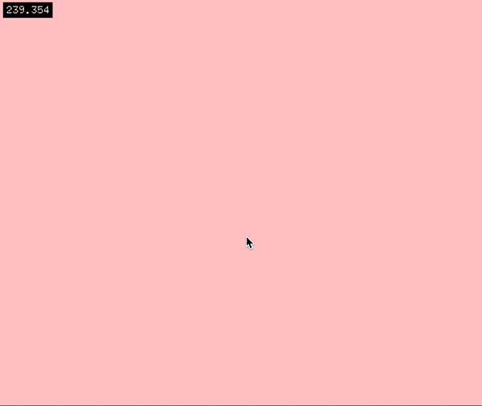

# ofxFilter

## Introduction

This addon is a realtime filter capable of smoothing and filtering streams of data in realtime. 

The base form of the data operated on is a transformation matrix (`glm::mat4`). The matrix describes all properties of a reference frame, including position, orientation and scale. However, not all of these attributes need be used. A filter can process a scalar, 2D point, 3D point, etc. using the appropriate `process()` function (see more below).

This filter is also capable of handling invalid input (when inputs are missing or obscured). In the example below, ofxFilter is used to "fill in" gaps of missing data. The "filling in" is in green; blue represents known data or data produced while observations are available.



## Requirements

- Openframeworks version 0.11.0+
- OF Addons, at the branches/commits linked below:
  - [ofxCv](https://github.com/local-projects/ofxCv/tree/project/lp.rtls-server)
  - [ofxRemoteUI](https://github.com/local-projects/ofxRemoteUI)

## Structure

An ofxFilter consists of a number of layered operators. Each operator acts on the data output by the previous operator and in so doing, information is transformed as it passes through a stack of layers. 

A layer is called an `ofxFilterOp`. Available layers include:

| Layer Key                              | Description                                                  |
| -------------------------------------- | ------------------------------------------------------------ |
| [`add-rate`](#ofxFilterOpAddRate)      | This layer adds differentiable rates (of order `n`) to the `mat4`, in the form of a `mat4rate` object. Rates describe the change of a value from one frame to another. Rates are not calculated by default, since not all ops require them. When an op requires rates, place this layer before it. |
| [`age`](#ofxFilterOpAge)               | This layer only allows data of a certain age to pass through. It is a "wrappable" layer, which means it wraps the entire stack in an operator. Only one of these operators can be used per filter. |
| [`axes`](#ofxFilterOpAxes)             | This layer can adjust the coordinate system axes by changing the handedness (right or left) of a coordinate system and the up vector (X, Y, or Z) of that system. |
| [`continuity`](#ofxFilterOpContinuity) | This layer is capable of making predictions to "fill in" missing data. Is is also capable of "merging" predicted data with known data, hence the name "continuity." It is designed to intelligently fill in gaps when new information is unavailable. It must follow the `add-rate` operator with `order=3`. |
| [`easing`](#ofxFilterOpEasing)         | This layer applies an ease to the data.                      |
| [`kalman`](#ofxFilterOpKalman)         | This layer applies a kalman filter to the data.              |
| [`none`](#ofxFilterOpEasing)           | This layer does not transform the data.                      |
| [`persist`](#ofxFilterOpPersist)       | This layer forces invalid data to be valid for a number of frames. It can be useful to force tracking across multiple consecutive frames when other operators would otherwise prevent this. |
| [`transform`](#ofxFilterOpTransform)   | This layer will apply a transformation to the data. Available transformations include scale, rotate, and translation (applied in this order). Rotation is supplied via euler angles applied in Yaw-Pitch-Roll (YXZ) order. |

A group of filters that share the same settings (types, locations and quantity of ops) can be contained with an `ofxFilterGroup` dictionary, where each filter is accessible via a key string.

A filter's operators are defined by a string containing each op key in order, separated by a comma. For example, `"kalman,add-rate,continuity"` describes the filter containing a Kalman operator, followed by an Add Rate operator, followed by a Continuity operator.

## Usage

Make sure to include the following Preprocessor Definitions (macros) in your project:

- `GLM_EXT_INCLUDED`
- `GLM_ENABLE_EXPERIMENTAL`

Then, usage follows this form:

ofApp.h

```c++
ofxFilterGroup group;
```

ofApp.cpp

```c++
void setup() {
  
  // Setup the Remote UI
  RUI_SET_CONFIGS_DIR("configs");
  RUI_SETUP();
  RUI_LOAD_FROM_XML();
  
  // Setup the Filter Group with a name and operator types. 
  // All filters in this group will process data using a kalman op, then an add-rate op,
  // then a continuity op, using the same settings.
  group.setup("myGroupName", "kalman,add-rate,continuity");
  
  // Filters are created as soon as they are queried. No need to create ahead of time.
}

void update() {
  
  // Update the first filter with new data, for example, mouse coordinates.
  if (mousePressed) {
    // If valid data is available, the process with it.
    glm::vec2 position = {mouseX, mouseY};
    filters.getFilter("mouseFilter")->process(position);
  } else {
    // If new data is not available, we can process the filter without, and yield a 
    // prediction as output.
    filters.getFilter("mouseFilter")->process();
  }
  
  // Update the second filter with new data, for example, rotation data.
  filters.getFilter("rotationFilter")->process(glm::quat({pitch, yaw, roll}));
}

void draw() {
  
  // Get the mouse prediction and draw it. For data streams with invalid data, we can
  // check the validity of predictions before drawing them.
  if (filters.getFilter("mouseFilter")->isDataValid()) {
    glm::vec2 position = filters.getFilter("mouseFilter")->getPosition2D();
    ofDrawCircle(position, 10);
  }
  
  // Get the other prediction data
  filters.getFilter("rotationFilter")->getOrientation();
}
```

For a complete demo, see the example provided in the folder `example`. 

## Parameters

Following are the parameter groups and their `variables`, with names corresponding to those in the *ofxRemoteUISettings.rui* file. 

All parameters that change data incrementally from frame to frame, like easing params and exponents (powers) are normalized to 60 fps. This means that a change in FPS will not change the behavior of data with the same parameters.

### ofxFilterUnits

This is a singleton that contains global variables and conversations relevant across all filters.

| Parameter | Type  | Range     | Default | Description       |
| --------- | ----- | --------- | ------- | ----------------- |
| `FPS`     | float | (0, +inf) | 60      | frames per second |

### ofxFilterOp

This is the `none` operator. It has no parameters.

### ofxFilterOpEasing

| Parameter         | Type  | Range      | Default | Description                                                  |
| ----------------- | ----- | ---------- | ------- | ------------------------------------------------------------ |
| `Easing Param`    | float | [0, 1)     | 0.9     | Fraction of information retained in an ease / lerp / mix. For example, `data = glm::mix(newData, lastData, param)`. |
| `Frames To Reset` | int   | [-1, +inf) | 1       | After how many invalid frames will the operator be reset? A negative value indicates the ease will never reset. A positive value *n* indicates that the operator will be reset after *n* frames. |

### ofxFilterOpKalman

| Parameter           | Type  | Range        | Default | Description                                                  |
| ------------------- | ----- | ------------ | ------- | ------------------------------------------------------------ |
| `Smoothness`        | float | (-inf, +inf) | 3       | How smooth should the data be?                               |
| `Rapidness`         | float | (-inf, +inf) | 1       | How quick should the filter be to respond?                   |
| `Use Accel`         | bool  |              | true    | Should the filter use acceleration in its calculations?      |
| `Use Jerk`          | bool  |              | false   | Should the filter use jerk and acceleration in its calculations? |
| `Predict Empty`     | bool  |              | false   | Should this filter make predictions when there is no data? This filter is capable of making predictions, but is not reliable in the long term because of divergent high-order rates. |
| `Max Empty Pred`    | int   | [-1, +inf)   | 1       | The maximum number of consecutive predictions this filter will make on invalid (empty) input data. After this number of frames, the filter will stop making predictions (and export invalid data). A negative value indicates infinite empty predictions. |
| `Reset After Empty` | bool  |              | true    | Should the filter reset after invalid data? Almost always, the answer is yes. |

### ofxFilterOpAddRate

| Parameter         | Type | Range     | Default | Description                                                  |
| ----------------- | ---- | --------- | ------- | ------------------------------------------------------------ |
| `Order`           | int  | [1, +inf) | 3       | What order of rates are to be calculated? Possible values include: 1 = no rates; 2 = velocity; 3 = velocity and acceleration; 4 = velocity, acceleration and jerk; etc. |
| `Frames To Reset` | int  | [0, +inf) | 3       | After how many invalid frames will the filter be reset?      |

#### RateForwardParams

These parameters describe how data is used to update rates.

| Parameter         | Type  | Range     | Default | Description                                                  |
| ----------------- | ----- | --------- | ------- | ------------------------------------------------------------ |
| `Fast Ease`       | float | [0, 1)    | 0.1     | Easing parameter describing how fast rates change when speeds are fast. |
| `Slow Ease`       | float | [0, 1)    | 0.95    | Easing parameter describing how fast rates change when speeds are slow. |
| `Default Ease`    | float | [0, 1)    | 0.8     | Easing parameter describing how fast rates change by default. The eases should have this relationship: `Fast Ease` < `Default Ease` < `Slow Ease`. |
| `Ease Power`      | float | (0, +inf) | 1.0     | How much more easing is applied to rates, the higher their order is? When = 1, then there is no difference across different orders. |
| `Max Trans Speed` | float | [0, +inf) | 1.0     | Maximum translational speed (in meters); used as a reference point to calculate an appropriate ease. |
| `Max Rot Speed`   | float | [0, +inf) | 90.0    | Maximum rotational speed (in degrees); used as a reference point to calculate an appropriate ease. |
| `Max Scale Speed` | float | [0, +inf) | 1.0     | Maximum scale speed (unitless); used as a reference point to calculate an appropriate ease. |

### ofxFilterOpContinuity

This operator has a few states, described by the booleans `bExporting`, `bLinked` and `data.bValid`. If exporting data, then `bExporting` is true. If `bLinked` is true, then the output is closely linked with the input and there is a minimal prediction. In this state, most of the input data is observed (known) (`data.bValid` = true). If `bLinked` is false, then the output is mostly predicted, attempting to "relink" with valid observations when they are seen again. In this state, most of the input data is invalid (absent) (`data.bValid` = false).

Relevant parameters include:

| Parameter               | Type | Range     | Default | Description                                                  |
| ----------------------- | ---- | --------- | ------- | ------------------------------------------------------------ |
| `Max Pred Frames`       | int  | [0, +inf) | 240     | For how many consecutive frames without valid data will this continue predicting? (This is the maximum span gap). |
| `Rate Order for Export` | int  | [0, +inf) | 1       | At what rate order will this being exporting?                |
| `Frames To Unlink`      | int  | [0, +inf) | 10      | After how many empty frames will predictions unlink from observations? |
| `LookaheadFrames`       | int  | [0, +inf) | 0       | In an unlinked state, how many frames do we look ahead to reconcile our current heading with? |
| `Linked Recon Mode`     | enum |           | 0       | How is newly observed data reconciled while linked? Modes include: {COPY_ALL = 0, COPY_FRAME = 1, COPY_FRAME_AND_UPDATE_RATE = 2}. |
| `New Link Recon Mode`   | enum |           | 0       | How is newly linked data reconciled with observational data? (same options as above). |

#### SimilarityParams

These parameters describe how a similarity decision is made. Given two pieces of data, the calculation that determines whether they are similar is governed by these parameters.

| Parameter          | Type  | Range     | Default | Description                                                  |
| ------------------ | ----- | --------- | ------- | ------------------------------------------------------------ |
| `Trans Thresh`     | float | [0, +inf) | 0.01    | What is the threshold (in meters) by which two pieces of data can be consdiered similar, from a translational perspective? |
| `Trans Mix`        | float | [0, 1]    | 1.0     | How much of translational similarity is used to judge overall similarity? This value is relative to the other mix parameters. |
| `Rot Thresh`       | float | [0, +inf) | 3.0     | What is the threshold (in degrees) by which two pieces of data can be consdiered similar, from a rotational perspective? |
| `Rot Mix`          | float | [0, 1]    | 0.0     | How much of rotational similarity is used to judge overall similarity? This value is relative to the other mix parameters. |
| `Scale Thresh`     | float | [0, +inf) | 0.01    | What is the threshold (unitless) by which two pieces of data can be considered similar, from a scalar perspective? |
| `Scale Mix`        | float | [0, 1]    | 0.0     | How much of scalar similarity is used to judge overall similarity? This value is relative to the other mix parameters. |
| `Num Rates`        | int   | [1, +inf) | 1       | How many rates do we compare for similarity? 1 = position only; 2 = position and velocity, etc. |
| `Rate Thresh Mult` | float | [1, +inf) | 10.0    | How much are the higher order rate thresholds multiples of the original thresholds? |
| `Rate Weight`      | float | [0, +inf) | 0.0     | How much are higher order rates weighted differently?        |

#### FrictionParams

These parameters describe how friction is applied. There are two sets of friction parameters: one for the linked state and another for the unlinked state.

| Parameter             | Type  | Range      | Default | Description                                                  |
| --------------------- | ----- | ---------- | ------- | ------------------------------------------------------------ |
| `Friction`            | float | [0, 1]     | 0.95    | The fraction of energy retained each step (frame).           |
| `Friction Rate Power` | float | [-1, +inf) | 2.0     | Friction gets progressively higher for higher order rates by a power function. This parameter describes how friction changes with rate order. Possible values include: -1 = no change; 0 = constant value; 1 = linearly increasing with order; 2 = exponentially increasing by a power of 2 with order. |

#### ConvergenceParams

These parameters describe how unlinked data attempts to converge with observed data (when observed data is available). Once converged, the predicted data relinks with observations.

| Parameter           | Type  | Range     | Default | Description                                                  |
| ------------------- | ----- | --------- | ------- | ------------------------------------------------------------ |
| `Epsilon Power`     | float | [0, +inf) | 5       | What exponent (negative power of 10) describes a practical zero? |
| `Max Trans Speed`   | float | [0, +inf) | 2.0     | Maximum reasonable translational speed (meters/sec) one would want data to move during convergence. |
| `Max Rot Speed`     | float | [0, +inf) | 90.0    | Maximum reasonable rotational speed (degrees/sec) one would want data to move during convergence. |
| `Max Scale Speed`   | float | [0, +inf) | 1.0     | Maximum reasonable scalar speed (/sec) one would want data to move during convergence. |
| `Approach Time`     | float | [0, +inf) | 1.0     | How many seconds before convergence should data begin to slow down to the observed data's speed? |
| `Approach Buf`      | float | [0, 1)    | 0.1     | Fraction of the approach time until the data's speed is the observed target's speed. |
| `Acc Step Power`    | float | [1, +inf) | 1.25    | How do speed thresholds differ for higher order rates? If this is 1, then higher order rates have the same maximum magnitude as those provided (`max __ speed`). If > 1, then higher order rates have a  smaller maximum magnitude than those provided. |
| `Target Speed Ease` | float | [0, 1)    | 0.5     | How much should the target speed be eased? Easing will prevent jumps in acceleration. Possible values include: 0 = no easing; 0.5 = half ease. Note: this is one of the only easing parameters that is not normalized to framerate. Normalizing this results in poor quality performance. |
| `Acc Mag Ease`      | float | [0, 1)    | 0.995   | How fast does the magnitude of the acceleration ease? Possible values include: 0 = no easing; 0.995 = rounded corners. |

#### RateReduceParams

When data transitions from being observed to being predicted, high order rates (acceleration+) must be reduced to prevent undesirable motion artifacts. These parameters describe how much it is reduced and when.

| Parameter      | Type  | Range     | Default | Description                                                  |
| -------------- | ----- | --------- | ------- | ------------------------------------------------------------ |
| `Opp Dir Mult` | float | [0, 1]    | 0.0     | By what fraction should a rate be reduced when its direction opposes the next lowest rate's direction? |
| `Aln Dir Mult` | float | [0, 1]    | 1.0     | By what fraction should a rate be reduced when its direction is aligned with the next lowest rate's direction? |
| `Power`        | float | (0, +inf) | 1.0     | This exponent sensitizes the range between opposing and aligned rates. A value < 1 makes orthogonal rates closer to `Aln Dir Mult`, while a value > 1 makes orthogonal rates closer to `Opp Dir Mult`. |

### ofxFilterOpAxes

In order to adjust a coordinate system's axes, the reference (source) handedness and up vector must be known. Supply those values in the first two variables:

| Parameter              | Type | Range        | Default | Description                                                  |
| ---------------------- | ---- | ------------ | ------- | ------------------------------------------------------------ |
| `Src Handedness`       | enum |              | 0       | Source handedness of the coordinate system (for reference). Values include {Right = 0, Left = 1}. |
| `Src Up Vector`        | enum |              | 1       | Source up vector of the coordinate system (for reference). Values include {X = 0, Y = 1, Z = 2}. |
| `Convert Handedness`   | bool |              | true    | Boolean indicating whether handedness should be converted to the destination handedness. |
| `Dst Handedness`       | enum |              | 0       | Desired handedness of the system. Same enum values as above in `Src Handedness`. |
| `Convert Up Vector`    | bool |              | true    | Boolean indicating whether up vector should be converted to the destination up vector. |
| `Dst Up Vector`        | enum |              | 1       | Desired up vector of the system. Same enum values as above in `Src Up Vector`. |
| `Num Up Vec Rotations` | int  | (-inf, +inf) | 0       | Number of 90º clockwise rotations around the up vector.      |

### ofxFilterOpAge

This operator wraps the entire operator stack. Only one can be used per filter. 

| Parameter                   | Type | Range     | Default | Description                                                  |
| --------------------------- | ---- | --------- | ------- | ------------------------------------------------------------ |
| `Min Age`                   | int  | [0, +inf) | 5       | Data must be at least this age (in frames) in order to be exported. |
| `Consecutive`               | bool |           | true    | Is this operator only applied to consecutive measurements? In other words, does invalid data reset this operator? |
| `Other Ops Extend Validity` | bool |           | true    | Can other operators extend the validity of data that passes through this operator? For example, can the `persist` operator make data valid and allow it to be passed through this `age` operator? |

### ofxFilterOpPersist

This operator forces validity of invalid data for a number of frames.

| Parameter    | Type | Range      | Default | Description                                                  |
| ------------ | ---- | ---------- | ------- | ------------------------------------------------------------ |
| `Num Frames` | int  | [-1, +inf) | 10      | Number of frames to persist validity. A negative value indicates that data persists indefinitely. |

### ofxFilterOpTransform

This operator applies a linear transformation matrix (from components scale, rotate and translate) to the data.

| Parameter        | Type  | Range        | Default | Description                                           |
| ---------------- | ----- | ------------ | ------- | ----------------------------------------------------- |
| `Translate X`    | float | (-inf, +inf) | 0.0     | X translation.                                        |
| `Translate Y`    | float | (-inf, +inf) | 0.0     | Y translation.                                        |
| `Translate Z`    | float | (-inf, +inf) | 0.0     | Z translation.                                        |
| `Rotate X Pitch` | float | (-inf, +inf) | 0.0     | Euler angle (degrees) of pitch, or rotation around X. |
| `Rotate Y Yaw`   | float | (-inf, +inf) | 0.0     | Euler angle (degrees) of yaw, or rotation around Y.   |
| `Rotate Z Roll`  | float | (-inf, +inf) | 0.0     | Euler angle (degrees) of roll, or rotation around Z.  |
| `Scale X`        | float | (-inf, +inf) | 1.0     | X scale.                                              |
| `Scale Y`        | float | (-inf, +inf) | 1.0     | Y scale.                                              |
| `Scale Z`        | float | (-inf, +inf) | 1.0     | Z scale.                                              |

## Troubleshooting

### Orientations produce strange artifacts

This addon is untested on orientation/rotation data. Contributions and bug-fixes are welcome.

### Continuity doesn't work as expected

TODO

### It doesn't run as fast as expected

The `kalman` operator is the most computationally intensive. On a computer with the following specs, the app was limited to processing 150 simultaneous 3D points at 240 fps:

- Processor	Intel(R) Core(TM) i7-9700K CPU @ 3.60GHz, 3600 Mhz, 8 Core(s), 8 Logical Processor(s)

### No member named `glm::eulerAngleYXZ`

Make sure to include the appropriate preprocessor macros [above](#usage).